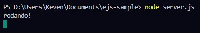
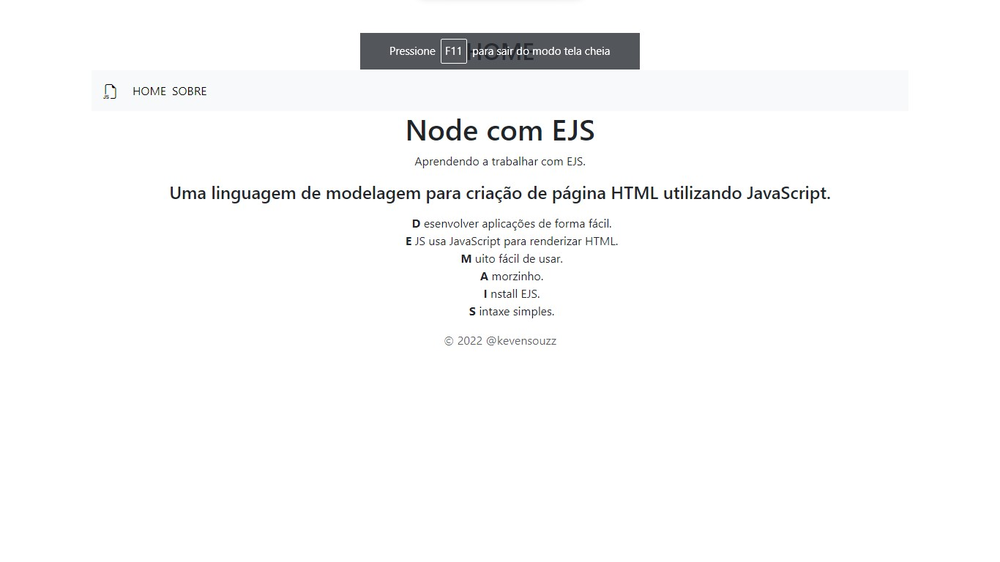

## Fixação de aprendizado | EJS

Este é um sistema simples desenvolvido enquato eu acompanhava o módulo `NodeJS + EJS`
na `Trilha fundamentar` da `Rocketseat`.

### Execute-o na sua máquina

> Para executar é necessário o *NodeJS* instalado
> No terminal, inserir *node* em seguida o caminho do arquivo `server.js`
> No navegador, inserir `Localhost:8080`.

===

 

