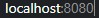

## Fixação de aprendizado | EJS

Este é um sistema simples desenvolvido enquato eu acompanhava o módulo `NodeJS + EJS`
na `Trilha fundamentar` da `Rocketseat`.

### Execute-o na sua máquina

***Para executar é necessário o *NodeJS* instalado***

> Com o repositório aberto na sua máquina, insira no terminal `npm install`   
> Com as dependências instaladas, insira *node* em seguida o caminho do arquivo `server.js`  
> Com o projeto rodando, no navegador, insira `Localhost:8080`.

---

